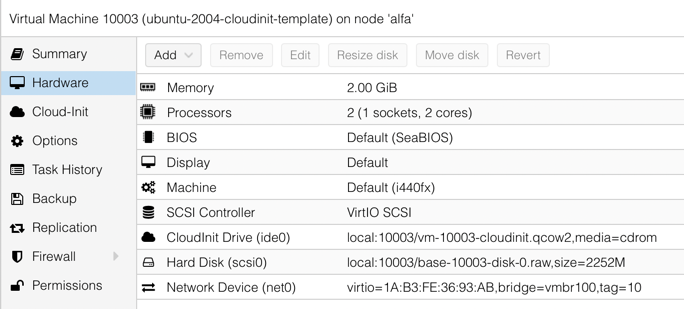
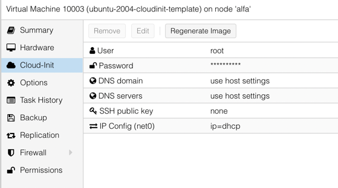
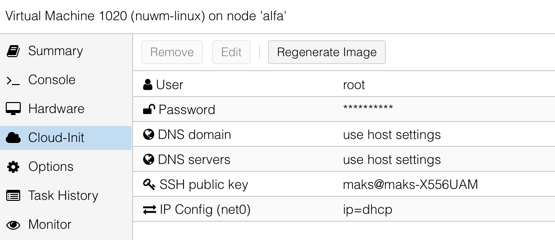
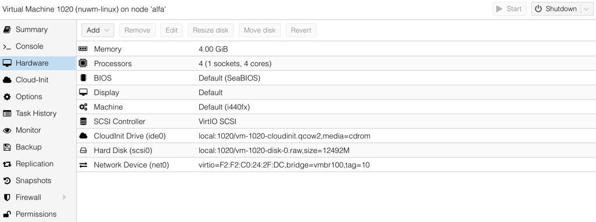
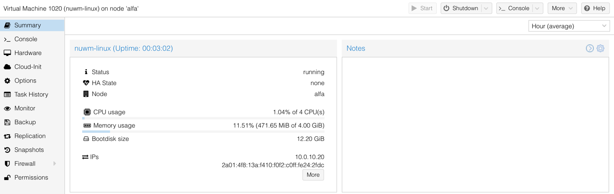
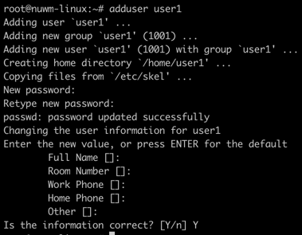
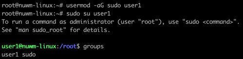

# Виконання домашнього завдання №1

## Налаштування образу

Для виконання потрібно встановити Ubuntu. Для встановлення обрав систему Proxmox 7 та Ubuntu server 20.04 cloud-init.

Першим етапом встановлення бло завантаження образу cloud-init. Далі встановимо потрібні пакети для роботи із цим образом

~~~
sudo apt update -y && sudo apt install libguestfs-tools -y
~~~

`libguestfs-tools` поставляє інструмент `virt-customize` для кастомізації образів.

Далі одифікуємо образ cloud-init для того, щоб встановити в нього пакет `qemu-guest-agent`

~~~
sudo virt-customize -a focal-server-cloudimg-amd64.img --install qemu-guest-agent
~~~

Далі створено віртуальну машину на основі модифікованого образу та створено темплейт для створення віртуальних машин в
Proxmox.

## Ствлрення віртуальної машини

З отриманого шаблону було створено віртуальну машину. Де було змінено hardware конфігурації та в cloud init, змінивши
характеристики машини та додано ssh ключ.

Далі віртуальну запустивши віртуальну машину вона отримала ssh ключ та інші налаштування.

## Налаштування та встановлення додаткового софта.
Пдіʼєднавшись до віртуалкі по ssh, створимо юзера та додавання його в групу sudo

Далі оновлено систему та додамо ssh ключ для нового користувача (в authorized_keys), також згенеруємо ключ ssh ключ для
цього користувача командо `ssh-keygen`

Встановимо потрібне програмне забезпечення

~~~
sudo apt install tmux git vim curl -y
~~~
