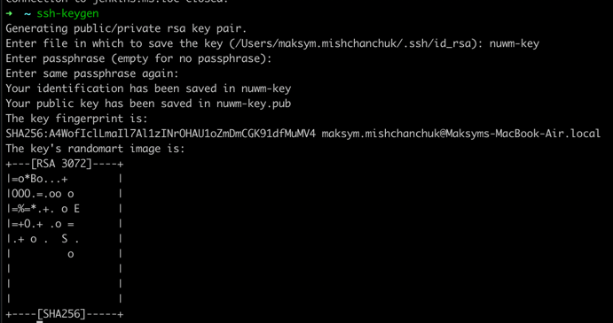

# Виконання домашнього завдання №2

## Завдання 1

Під час виконання попереднього завдання ssh ключ було додано з допомогою Proxmox. Тому тут цього робити не потрібно. Але
це можна зробити наступним чином:

- Генерація ssh ключа з допомогою утиліти `ssh-keygen`

- Далі його потрібно скопіювати з допомогою утиліти `ssh-copy-id`  передавши аргументами ключ та куди його потрібно
  скопіювати. Або додати у файл `authorized_keys` який зазвичай лежить за шляхом `~/.ssh/authorized_keys` 

## Завдання 2

Змінимо порт ssh. Це можна зробити змінити параметр `Port` у файлі `/etc/ssh/sshd_config` 

Далі підʼєднатись до віртуальної машини можна командою `ssh user1@10.0.10.20 -p 2222`

## Завдання 3

Використання SSH tunnelling може бути корисним, для доступу до певних ресурсів серверу, порти яких вісять на локалхості
або закриті фаєрволами. Наприклад підʼєднання до бази даних розміщеної на сервері до яйого є ssh доступ, але база даних вісить лише на локалхості.
Використовую такій кейс кожного дня, підʼєднання до БД на dev віртуалці.

Щоб прокинути тунель необхідно до стандартного підключення до ssh додати опцію `-L` та `-N` та додати "port forwarding" тобто на якій локальний порт ми хочемо прокинути порт на віддаленому сервері.
Прикладом може бути прокидання, 80 порту із мого тестового серверу jenkins, який прокинутий на 8888 порт на локальній машині.

