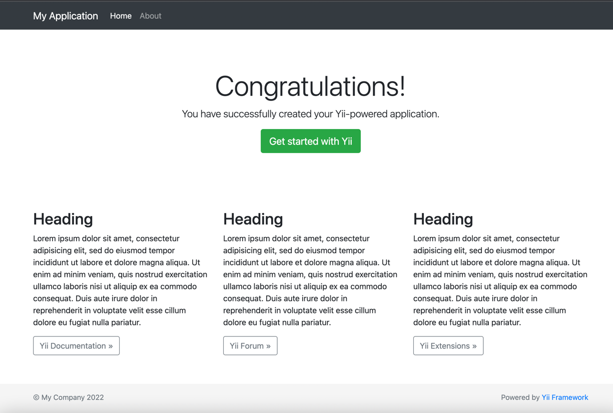
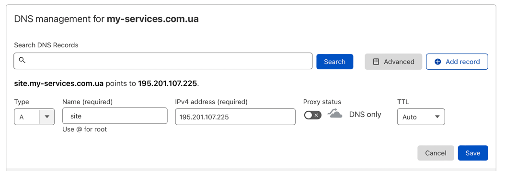

# Налаштуванн LEMP

### Встановлення

Вспершу встановимо все необхідне програмне забезпечення

~~~
sudo apt install nginx php-fpm php-mysql php-cli mysql-server mysql-client curl php-curl php-gd php-xml
~~~

Встановимо composer

~~~
curl -sS https://getcomposer.org/installer | php
sudo mv composer.phar /usr/local/bin/composer
~~~

Створимо базовий проект для фреймворку Yii2

~~~
composer create-project --prefer-dist yiisoft/yii2-app-basic site
~~~

Налаштуємо mysql з допомогою mysql_secure_installation

Створимо базу данних користувача та додамо пермішини для користувача

~~~
create database test_site;
CREATE USER 'test_site'@'localhost' IDENTIFIED BY 'password';
GRANT ALL PRIVILEGES ON test_site.* TO 'test_site'@'localhost';
~~~

Додамо конфіги для бази данних за шляхом
`/var/www/site/config/db.php` із вмістом

~~~
<?php

return [
    'class' => 'yii\db\Connection',
    'dsn' => 'mysql:host=localhost;dbname=test_site',
    'username' => 'test_site',
    'password' => 'password',
    'charset' => 'utf8',

    // Schema cache options (for production environment)
    'enableSchemaCache' => true,
    'schemaCacheDuration' => 60,
    //'schemaCache' => 'cache',
];
~~~

Створимо nginx конфіг `nano /etc/nginx/sites-available/site.my-services.com.ua`
із вмістом

~~~
server {
    charset utf-8;
    client_max_body_size 128M;

    listen 80; #listen for ipv4

    server_name site.my-services.com.ua; 

    root        /var/www/site/web;
    index       index.php;
    server_tokens off;

    access_log  /var/www/site/log/access.log;
    error_log   /var/www/site/log/error.log;

    location ~ ^/assets/.*\.php$ {
        deny all;
    }
    
    location / {
        try_files $uri $uri/ /index.php$args;
    }
    
    location ~ \.(php)$ {
        fastcgi_pass            unix:/var/run/php/php7.4-fpm.sock;
        fastcgi_index           index.php;
        fastcgi_read_timeout    300;
        fastcgi_param           SCRIPT_FILENAME  $document_root$fastcgi_script_name;
        fastcgi_param           HTTP_PROXY "";
        include                 fastcgi_params;
    }

    location ~* /\. {
        deny all;
    }
}
~~~

Додамо посилання в директорію `/etc/nginx/sites-enabled` та перезавантажимо сервіс `nginx`

~~~
sudo ln -s /etc/nginx/sites-available/site.my-services.com.ua /etc/nginx/sites-enabled/site.my-services.com.ua
sudo service nginx reload
~~~

Змінимо користувача до директорії із сайтом

~~~
sudo chown www-data:www-data -R /var/www/site
~~~

Перейшовши за IP адресою відкриється сторінка сайту.

Налаштуємо конфіг nginx для проксі на віртуальній машині на яку перенаправляється весь трафік із роутера, серверу
proxmox.

Конфіг:

~~~
server {
    listen 80;
    server_name site.my-services.com.ua; # domain name
    return 301 https://site.my-services.com.ua$request_uri;  # enforce https
}

server {
    listen          443 ssl;
    server_name     site.my-services.com.ua;

    charset utf-8;

    access_log  /var/log/nginx/site-access.log;
    error_log   /var/log/nginx/site-error.log;

    ssl_certificate /root/.acme.sh/site.my-services.com.ua/fullchain.cer;
    ssl_certificate_key /root/.acme.sh/site.my-services.com.ua/site.my-services.com.ua.key;

    ssl_protocols TLSv1.2;
    ssl_prefer_server_ciphers on;

    ssl_ciphers 'ECDHE-RSA-AES128-GCM-SHA256:ECDHE-ECDSA-AES128-GCM-SHA256:ECDHE-RSA-AES256-GCM-SHA384:ECDHE-ECDSA-AES256-GCM-SHA384:DHE-RSA-AES128-GCM-SHA256:DHE-DSS-AES128-GCM-SHA256:kEDH+AESGCM:ECDHE-RSA-AES128-SHA256:ECDHE-ECDSA-AES128-SHA256:ECDHE-RSA-AES128-SHA:ECDHE-ECDSA-AES128-SHA:ECDHE-RSA-AES256-SHA384:ECDHE-ECDSA-AES256-SHA384:ECDHE-RSA-AES256-SHA:ECDHE-ECDSA-AES256-SHA:DHE-RSA-AES128-SHA256:DHE-RSA-AES128-SHA:DHE-DSS-AES128-SHA256:DHE-RSA-AES256-SHA256:DHE-DSS-AES256-SHA:DHE-RSA-AES256-SHA:AES128-GCM-SHA256:AES256-GCM-SHA384:AES128-SHA256:AES256-SHA256:AES128-SHA:AES256-SHA:AES:CAMELLIA:DES-CBC3-SHA:!aNULL:!eNULL:!EXPORT:!DES:!RC4:!MD5:!PSK:!aECDH:!EDH-DSS-DES-CBC3-SHA:!EDH-RSA-DES-CBC3-SHA:!KRB5-DES-CBC3-SHA';

    ssl_session_timeout 1d;
    ssl_session_cache shared:SSL:50m;

	location / {
		proxy_set_header Host site.my-services.com.ua;
        proxy_pass http://10.0.10.20:80;
    }
}
~~~

Створимо посилання та перезавантажимо сервіс nginx.
~~~
ln -s /etc/nginx/sites-available/site.my-services.com.ua /etc/nginx/sites-enabled/site.my-services.com.ua
~~~

Додамо новий DNS запис в cloudflare

Створимо SSL сертифікат від ZeroSSL з допомогою acme.sh.
~~~
acme.sh --issue --nginx -d site.my-services.com.ua
~~~
Але для генерації сертифікат потрібно підправити конфіг, щоб він працював по http
~~~
#server {
#    listen 80;
#    server_name site.my-services.com.ua; # domain name
#    return 301 https://site.my-services.com.ua$request_uri;  # enforce https
#}

server {
    listen 80;
#    listen          443 ssl;
    server_name     site.my-services.com.ua;

    charset utf-8;

    access_log  /var/log/nginx/site-access.log;
    error_log   /var/log/nginx/site-error.log;

#    ssl_certificate /root/.acme.sh/site.my-services.com.ua/fullchain.cer;
#    ssl_certificate_key /root/.acme.sh/site.my-services.com.ua/site.my-services.com.ua.key;

#    ssl_protocols TLSv1.2;
#    ssl_prefer_server_ciphers on;

#    ssl_ciphers 'ECDHE-RSA-AES128-GCM-SHA256:ECDHE-ECDSA-AES128-GCM-SHA256:ECDHE-RSA-AES256-GCM-SHA384:ECDHE-ECDSA-AES256-GCM-SHA384:DHE-RSA-AES128-GCM-SHA256:DHE-DSS-AES128-GCM-SHA256:kEDH+AESGCM:ECDHE-RSA-AES128-SHA256:ECDHE-ECDSA-AES128-SHA256:ECDHE-RSA-AES128-SHA:ECDHE-ECDSA-AES128-SHA:ECDHE-RSA-AES256-SHA384:ECDHE-ECDSA-AES256-SHA384:ECDHE-RSA-AES256-SHA:ECDHE-ECDSA-AES256-SHA:DHE-RSA-AES128-SHA256:DHE-RSA-AES128-SHA:DHE-DSS-AES128-SHA256:DHE-RSA-AES256-SHA256:DHE-DSS-AES256-SHA:DHE-RSA-AES256-SHA:AES128-GCM-SHA256:AES256-GCM-SHA384:AES128-SHA256:AES256-SHA256:AES128-SHA:AES256-SHA:AES:CAMELLIA:DES-CBC3-SHA:!aNULL:!eNULL:!EXPORT:!DES:!RC4:!MD5:!PSK:!aECDH:!EDH-DSS-DES-CBC3-SHA:!EDH-RSA-DES-CBC3-SHA:!KRB5-DES-CBC3-SHA';

#    ssl_session_timeout 1d;
#    ssl_session_cache shared:SSL:50m;

	location / {
		proxy_set_header Host site.my-services.com.ua;
        proxy_pass http://10.0.10.20:80;
    }
}
~~~

Після успішної генерації сертифікату потрібно повернути конфіг в попередній варіант та перезавантажити nginx.
В результаті можна буде потрапити на сайт за [посиланням](https://site.my-services.com.ua/)