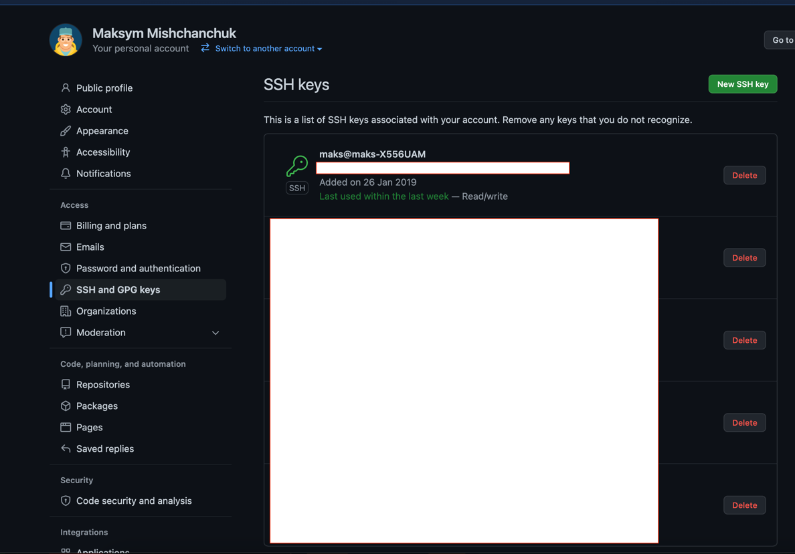
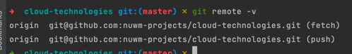

# Робота зі git

В якості репо для експерементальної гри використано це репо.

Дя доступу до репо забезпечується з допомогою ssh ключа (ключ старий як світ).

Було створено декілька гілок і помержено їх.

Під час мержу виправлено конфлікт

