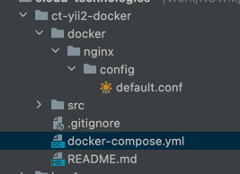
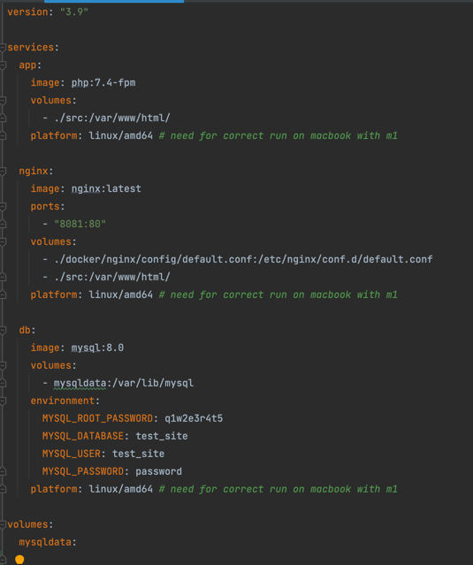
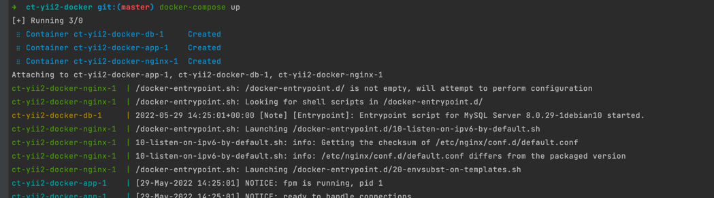
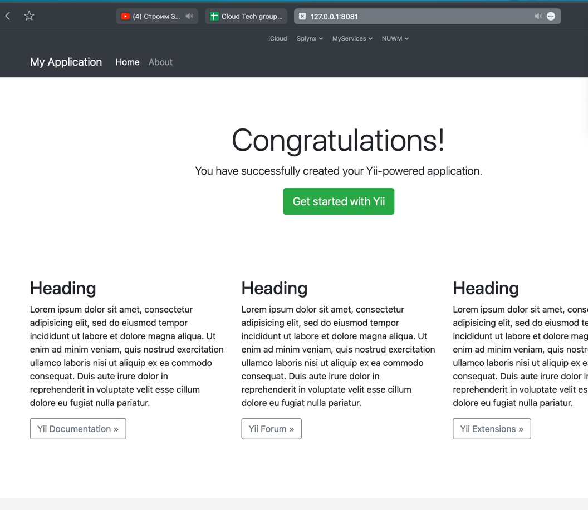

# Контейнеризація YII2

Встановивши докер відповідно до документації було розгорнуто yii апку в докері.

Структура проекту має настпний вигляд, в папці src лежить код проект на yii2

Створено docker-compose файл для опису контейнерів

Піднімемо апку з допомогою docker-compose

Перейшовши на 127.0.0.1 на порт 8081 буде видно результат розгортання апки.

Посилання на [код](https://github.com/nuwm-projects/ct-yii2-docker/tree/v0.1_base_docker)